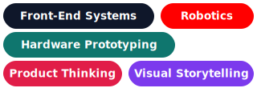
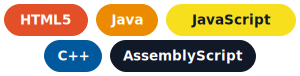
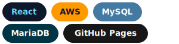
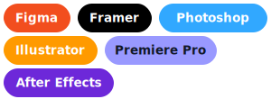
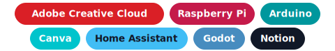

  

  

    
    
  

<table>
  <tr>
    <td width="62%" valign="top">
      <h2>About</h2>
      

        My work lives where engineering rigor meets design taste. I like building systems that solve practical
        problems, communicate clearly, and still leave room for personality.
      

      

        That has taken shape through robotics, front-end development, hardware projects, creative tooling, and product
        thinking that bridges the technical side with the human one.
      

    </td>
    <td width="38%" valign="top">
      <h2 align="center">Focus</h2>
      

        
      

    </td>
  </tr>
</table>

<h2 align="left">Toolbox</h2>

<table>
  <tr>
    <td width="33%" valign="top">
      <h3 align="center">Languages</h3>
      

        
      

    </td>
    <td width="33%" valign="top">
      <h3 align="center">Web And Cloud</h3>
      

        
      

    </td>
    <td width="33%" valign="top">
      <h3 align="center">Design And Creative</h3>
      

        
      

    </td>
  </tr>
  <tr>
    <td colspan="3" valign="top">
      <h3 align="center">Hardware And Tools</h3>
      

        
      

    </td>
  </tr>
</table>

<h2>GitHub Stats</h2>

  

  

